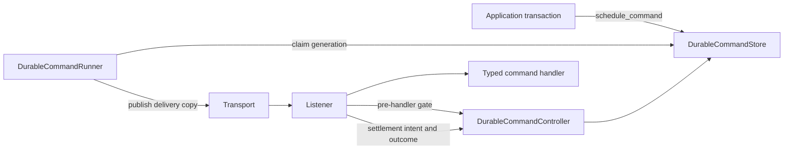
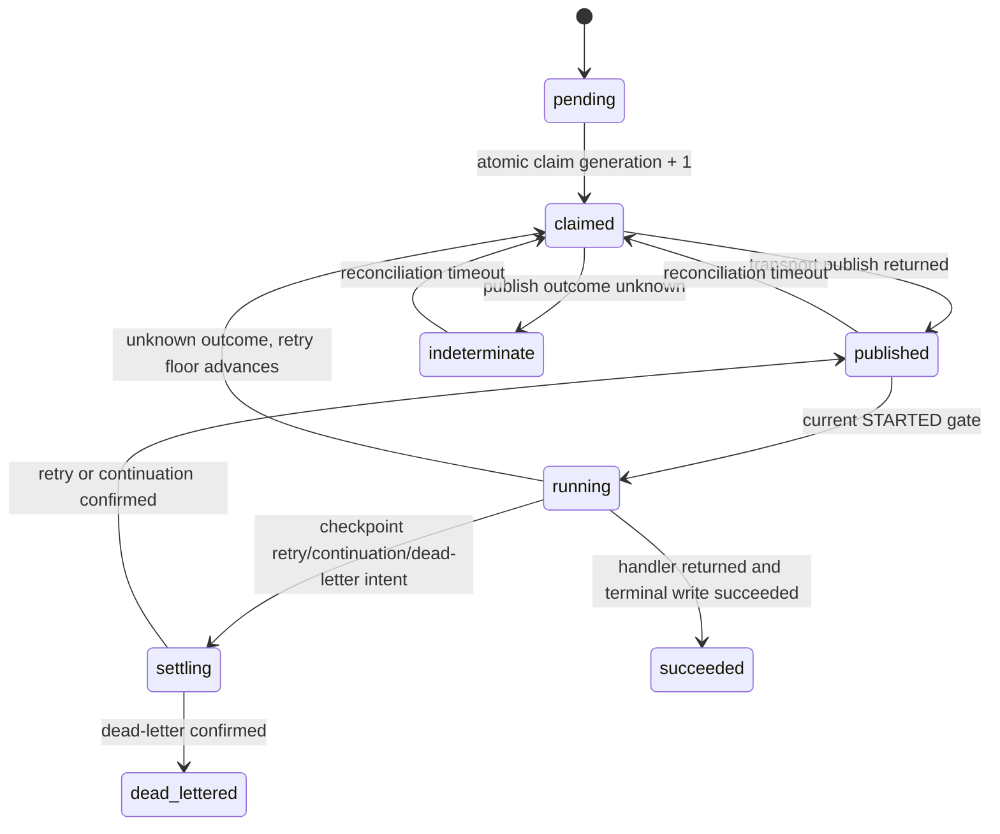
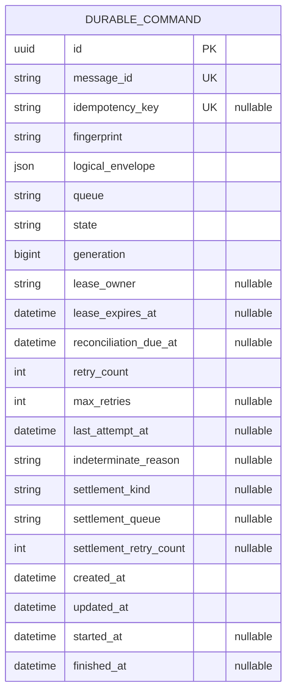

# Durable Typed Commands

Status: APPROVED FOR IMPLEMENTATION
Issue: https://github.com/nanaduah1/pybus/issues/36

## Problem and outcome

Applications currently have to build a database job engine around Pybus to persist a
typed command, claim it safely, preserve delivery identity, project retries and terminal
outcomes, and recover after restart. Pybus should own those generic mechanics while
applications keep domain commands, handlers, authorization, and presentation.

The first slice lets a configured Django application call:

```python
pybus.schedule_command(RunCollectionsEnroll(...))
```

Scheduling writes one durable record in the caller's database transaction and performs no
transport I/O. A separate durable-command worker claims and publishes the command. The
ordinary Pybus worker invokes the typed handler and projects delivery state back into the
record.

## Goals

- Persist one-off typed commands before publication.
- Keep the normal caller API concise and `send_command()` unchanged.
- Preserve stable message identity and canonical retry state across restart.
- Fence expired publishers and discard stale or already-terminal deliveries before the
  business handler runs.
- Ship an opt-in Django implementation without importing Django from core.
- Remain explicitly at-least-once across the database/transport boundary.

## Non-goals

Priority, recurrence, caller-selected future scheduling, cancellation, redrive, admin UI,
workflow graphs, non-Django production stores, distributed leadership, transport claim/ack
redesign, and exactly-once execution.

## Components



Core owns immutable records, transition rules, the store protocol, controller, and runner.
`pybus.integrations.django_durable` owns the model, migrations, and Django store.

## Public API

```python
handle = pybus.schedule_command(command, idempotency_key=None)
worker = bus.create_durable_command_worker()
```

`DurableCommandPolicy` configures claim leases and the reconciliation delay for
both publisher and consumer state. `BusConfiguration` supplies the shared
policy; one publisher worker may override it explicitly.

`BusConfiguration` accepts an optional `durable_command_store_factory`. When absent,
durable APIs fail with a configuration error and all existing behavior is unchanged.
Routing is resolved from the command declaration and bus topology. The durable worker is a
publisher; the existing ordinary worker remains the command consumer.

Idempotency rules:

- no key: every call creates new work;
- same key and same canonical command/type/version/headers/queue: return the existing handle;
- same key with a different fingerprint: raise `DurableCommandConflictError`;
- database uniqueness is authoritative under concurrent callers.

## Logical envelope and delivery copy

The store persists one immutable, versioned JSON logical envelope. A claim creates a
delivery copy that preserves message ID, type, version, payload, creation time, correlation
metadata, and application headers while adding reserved framework metadata:

- `pybus_durable_generation`
- `pybus_durable_record`

Normal callers cannot set these headers. Retry, continuation, and dead-letter copies preserve
them. `CommandDeliveryOutcome` appends optional durable record/generation fields with defaults
so ordinary commands and existing observers remain compatible.

## State model



`succeeded` and `dead_lettered` are irreversible. All writes compare record ID, generation,
expected state, and monotonic retry state. A fast consumer may reach `running` or terminal
before the publisher records `published`; the later publisher update must be a no-op rather
than regress state.

## Handler admission and settlement

Before a durable handler executes, the controller atomically decides:

- current generation and eligible nonterminal record: record `running` and proceed;
- stale generation, duplicate active delivery, or terminal record: discard without invoking
  the handler;
- missing/corrupt metadata, missing record, future generation, or unavailable store: restore
  the command and abort fail-closed.

For retry, continuation, and dead-letter paths, the listener checkpoints settlement intent
before transport publication. Recovery can therefore finish an intended settlement without
resetting retry state or rerunning the handler. A missing success write remains at-least-once:
after its reconciliation deadline, recovery may invoke the idempotent handler again.

Retries never decrease. A `running` record with an unknown outcome consumes one conservative
retry step before recovery. If its known budget is exhausted, it remains explicitly
indeterminate for reconciliation rather than receiving a fresh budget.

## Django data model



The app has an explicit stable label/table. Claims commit before transport I/O. Eligibility
and every transition use conditional updates; PostgreSQL row locking may optimize selection,
but compare-and-swap conditions remain the correctness mechanism. Scheduling is atomic with
application work only when both use the configured same database alias.

The migration is additive and opt-in. Operational rollback disables configuration and runners
while retaining the table. Reverse migration refuses to drop a nonempty table.

## Failure modes and recovery

| Failure | Durable behavior |
|---|---|
| transaction rollback | no durable row and no publication |
| crash after claim, before publish | lease expiry permits generation-fenced reclaim |
| publish acknowledgement unknown | record becomes indeterminate; no immediate replay |
| stale delivery arrives | consumed without handler execution |
| store unavailable at STARTED | restore unchanged command and abort worker |
| retry/continuation callback lost | pre-settlement checkpoint preserves queue/retry floor |
| post-handler success write lost | at-least-once recovery may rerun the handler |
| terminal duplicate or stale outcome | ignored; terminal state remains unchanged |

Generation fencing protects framework state, not arbitrary handler side effects. Handlers must
remain idempotent or use inbox/domain guards.

## Verification and rollout

- Core/import tests block Django and Redis imports.
- Django tests cover commit, nested rollback, alias behavior, migrations, idempotency races,
  claim races, restart, and terminality.
- Memory and Redis delivery tests prove reserved metadata survives continuation, retry, and
  dead-letter paths.
- A built wheel is inspected for the Django app and migration.
- The feature stays dark until an application installs the optional app, runs its migration,
  configures the store factory, and starts the durable publisher worker.
