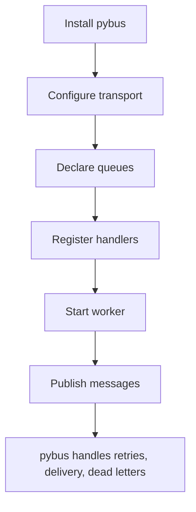

# pybus Developer Experience Contract

Status: TARGET CONTRACT
Date: 2026-07-10

This document describes the experience `pybus` should provide to a consuming
application when the framework is used the way it was originally intended.

The goal is simple:

- install `pybus`
- choose a transport
- rely on the built-in default queue and dead-letter queue
- declare additional queues as needed
- define messages
- define handlers
- let the framework wire the rest

If a team still needs to hand-wire routing, retry policy, dead-letter handling,
or transaction safety for every handler, then the framework is still too low
level.

---

## 1. Product Shape

`pybus` should feel like an application framework for async business work, not
just a bag of transport primitives.

The core should own the infrastructure concerns:

- envelope creation
- serialization
- transport plumbing
- queue routing
- retries
- dead-lettering
- listener loop
- request/response correlation
- delivery safety helpers

The consuming app should own the business concerns:

- message definitions
- queue intent
- handler logic
- idempotency rules
- domain validation
- payload shaping

---

## 2. Target Consumption Flow

The intended setup flow is:

1. install `pybus`
2. configure a transport
3. use the built-in default and dead-letter queues, then add any extra queues
4. register handlers
5. start the worker
6. publish messages



That flow should work without each app re-implementing its own message bus
plumbing.

---

## 3. What The Framework Should Do

The framework should provide the following by default:

- typed message envelopes
- JSON wire format
- handler registry and dispatch
- transport abstraction
- listener / worker runtime
- retry policy
- dead-letter routing
- request/response correlation
- inbox / outbox compatibility hooks

The framework should make the reliability model visible and boring:

- at-least-once delivery
- retry on transient failure
- dead-letter on exhaustion
- explicit correlation for request/response
- optional deduplication for consumers that need it

---

## 4. What The Application Should Still Define

Even with a strong framework, each app still owns its own semantics.

The app should define:

- message classes and versioning
- any extra queue naming beyond the built-in defaults
- event versus command intent
- handler placement
- business validation
- idempotency strategy
- retry-sensitive behavior

That is the part that should remain local to the app because it encodes the
domain.

---

## 5. Example Shape

The target public shape should read like this:

```python
transport = pybus.configure_transport(...)
pybus.declare_queue("billing")
pybus.declare_queue("billing.failed")


@pybus.event_handler("student.enrolled")
def handle_student_enrolled(event):
    ...


@pybus.command_handler("billing.generate_student_bill")
def handle_generate_student_bill(command):
    ...


pybus.publish_event(StudentEnrolled(...))
pybus.send_command(GenerateStudentBill(...))
```

The exact helper names may evolve, but the division of responsibility should
not:

- the app declares intent
- `pybus` wires execution and reliability

---

## 6. Success Criteria

The framework is doing its job when a new app can answer these questions
without building a custom bus:

1. How do I publish an event?
2. How do I route it to the right queue?
3. How are failures retried?
4. What happens when retries are exhausted?
5. How do I define a handler?
6. How do I keep request/response correlated?

If those answers require copy-pasting the old application framework, then the
extraction is still incomplete.
